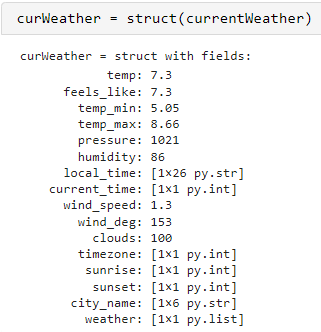
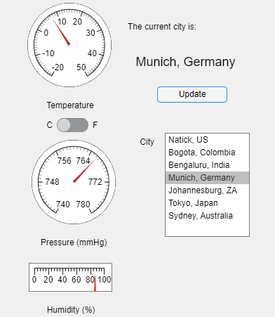

# Programming: A Starter Project Using MATLAB with Python

 or 

**Curriculum Module**

_Created with R2022a. Compatible with R2022a and later releases._

# Information

This curriculum module contains interactive [MATLAB® live scripts](https://www.mathworks.com/products/matlab/live-editor.html) that teach fundamental concepts and basic terminology related to programming computers. 

# Prerequisite Domain Knowledge

This module assumes familiarity with basic programming concepts such as variables, data types, and functions, structures including arrays and structs, and control flows including if/else as well as how to use them in MATLAB. These ideas are all presented with interactive examples in [<u>Fundamentals of Programming</u>](https://www.mathworks.com/matlabcentral/fileexchange/103225-fundamentals-of-programming), [<u>Programming: Organizing Data</u>](https://www.mathworks.com/matlabcentral/fileexchange/115900-programming-organizing-data), [<u>Programming: Structuring Code</u>](https://www.mathworks.com/matlabcentral/fileexchange/115905-programming-structuring-code).

## Background

You can use these live scripts as demonstrations in lectures, class activities, or interactive assignments outside class. This module explores interactions between systems by using the OpenWeather API and calling into Python from MATLAB. **Programming: A Starter Project Using MATLAB with Python** covers using the Run Python Code Live Task to run provided Python code, accessing the OpenWeather API to check the weather, extracting useful data from the API call, and using App Designer to create an app with a personalized weather display.

The instructions inside the live scripts will guide you through the exercises and activities. Get started with each live script by running it one section at a time. To stop running the script or a section midway (for example, when an animation is in progress), use the  Stop button in the **RUN** section of the **Live Editor** tab in the MATLAB Toolstrip.

## Contact Us

Solutions are available upon instructor request. Contact the [MathWorks teaching resources team](mailto:onlineteaching@mathworks.com) if you would like to request solutions, provide feedback, or if you have a question.

## Prerequisites

This module assumes familiarity with basic programming concepts such as variables, data types, and functions, structures including arrays and structs, and control flows including if/else as well as how to use them in MATLAB. These ideas are all presented with interactive examples in [<u>Fundamentals of Programming</u>](https://github.com/MathWorks-Teaching-Resources/Fundamentals-of-Programming), [<u>Programming: Organizing Data</u>](https://github.com/MathWorks-Teaching-Resources/Programming-Organizing-Data), [<u>Programming: Structuring Code</u>](https://github.com/MathWorks-Teaching-Resources/Programming-Structuring-Code).

## Getting Started
### Accessing the Module
### **On MATLAB Online:**

Use the  link to download the module. You will be prompted to log in or create a MathWorks account. The project will be loaded, and you will see an app with several navigation options to get you started.

### **On Desktop:**

Download or clone this repository. Open MATLAB, navigate to the folder containing these scripts and double\-click on [MATLABwithPython.prj](https://matlab.mathworks.com/open/github/v1?repo=MathWorks-Teaching-Resources/Programming-A-Starter-Project-Using-MATLAB-and-Python&project=MATLABwithPython.prj). It will add the appropriate files to your MATLAB path and open an app that asks you where you would like to start. 

Ensure you have all the required products ([listed below](#H_E850B4FF)) installed. If you need to include a product, add it using the Add\-On Explorer. To install an add\-on, go to the **Home** tab and select   **Add-Ons** > **Get Add-Ons**. 

## Products

MATLAB® is used throughout. Tools from the Symbolic Math Toolbox™ are used to convert between different unit systems in the weather applications.

# Scripts

 *If you are viewing this in a version of MATLAB prior to R2023b, you can view the learning outcomes for each script* [*here*](https://github.com/MathWorks-Teaching-Resources/Programming-A-Starter-Project-Using-MATLAB-and-Python)*.*

## [**UsingMATLABwithPython.mlx**](https://matlab.mathworks.com/open/github/v1?repo=MathWorks-Teaching-Resources/Programming-A-Starter-Project-Using-MATLAB-and-Python&project=MATLABwithPython.prj&file=UsingMATLABwithPython.mlx) 
| **Introductory script**    | **In this script, students will...**     |
| :-- | :-- |
|     |  -  check that an appropriate version of Python is installed and visible within MATLAB    -  explore the Run Python Code Live Task    -  try running Python commands and a Python script from MATLAB     |

## [**CheckingTheWeather.mlx**](https://matlab.mathworks.com/open/github/v1?repo=MathWorks-Teaching-Resources/Programming-A-Starter-Project-Using-MATLAB-and-Python&project=MATLABwithPython.prj&file=CheckingTheWeather.mlx) 
| **Investigatory script**    | **In this script, students will...**     |
| :-- | :-- |
|     |  -  set up an account with OpenWeather to create your own API key    -  use existing Python code to make an API call to OpenWeather    -  use MATLAB to explore the data returned by the API call, including data type conversions and unit conversions     |

## [**CreateCurrentWeatherApp.mlx**](https://matlab.mathworks.com/open/github/v1?repo=MathWorks-Teaching-Resources/Programming-A-Starter-Project-Using-MATLAB-and-Python&project=MATLABwithPython.prj&file=CreateCurrentWeatherApp.mlx) 
| **Application script**    | **In this script, students will...**     |
| :-- | :-- |
|     |  -  use App Designer to build a custom app using the code from CheckingTheWeather.mlx    -  create callbacks, properties, and functions    -  design and organize a UI with drag and drop elements    -  reuse code from CheckingTheWeather in a new context     |

# Apps

Both of these apps require running Python from MATLAB, as set up in [UsingMATLABwithPython](#H_00FC9291) and an OpenWeather API key, as set up in [CheckingTheWeather](#H_39C74124).

-  **<samp>CurrentWeatherAppDemo.mlapp</samp>** shows the results of working through CreateCurrentWeatherApp.  
-  **<samp>WeatherDisplay.mlapp</samp>** shows one elaborated version of the basic current weather app.  

# Additional Scripts

For those with a legacy OpenWeather API key, or the willingness to sign up for the OneCall 3.0 API, the original weather forecasting exploration from this courseware module is included as well.

[WeatherForecast.mlx](https://matlab.mathworks.com/open/github/v1?repo=MathWorks-Teaching-Resources/Programming-A-Starter-Project-Using-MATLAB-and-Python&project=MATLABwithPython.prj&file=WeatherForecast.mlx)

[SampleWeatherDashboard.mlx](https://matlab.mathworks.com/open/github/v1?repo=MathWorks-Teaching-Resources/Programming-A-Starter-Project-Using-MATLAB-and-Python&project=MATLABwithPython.prj&file=SampleWeatherDashboard.mlx)

# License

The license for this module is available in the [LICENSE.md](https://github.com/MathWorks-Teaching-Resources/Programming-A-Starter-Project-Using-MATLAB-and-Python/blob/release/LICENSE.md).

# Related Courseware Modules
| **Courseware Module**    | **Sample Content**    | **Available on:**     |
| :-- | :-- | :-- |
| [**Fundamentals of Programming**](https://www.mathworks.com/matlabcentral/fileexchange/103225-fundamentals-of-programming)    Learn the basics of how to make a computer    accept, store, and compute with information    |     |       [GitHub](https://github.com/MathWorks-Teaching-Resources/Fundamentals-of-Programming)     |
| [**Programming: Structuring Code**](https://www.mathworks.com/matlabcentral/fileexchange/115905-programming-structuring-code)   Learn how to organize your code into functions,    debug, comment, and share    |     |       [GitHub](https://github.com/MathWorks-Teaching-Resources/Programming-Structuring-Code)     |
|  [**Programming: Organizing Data**](https://www.mathworks.com/matlabcentral/fileexchange/115900-programming-organizing-data)   Learn more about strings, numeric data types,    memory, and ways of storing data    |     |      [GitHub](https://github.com/MathWorks-Teaching-Resources/Programming-Organizing-Data)     |

Or feel free to explore our other [modular courseware content](https://www.mathworks.com/matlabcentral/fileexchange/?q=tag%3A%22courseware+module%22&sort=downloads_desc_30d).

# Educator Resources
-  [Educator Page](https://www.mathworks.com/academia/educators.html) 

# Contribute 

Looking for more? Find an issue? Have a suggestion? Please contact the [MathWorks teaching resources team](mailto:%20onlineteaching@mathworks.com). If you want to contribute directly to this project, you can find information about how to do so in the [CONTRIBUTING.md](https://github.com/MathWorks-Teaching-Resources/Programming-A-Starter-Project-Using-MATLAB-and-Python/blob/release/CONTRIBUTING.md) page on GitHub.

# Acknowledgements

Many thanks to Blake Naccarato on his suggestions for improvement.

 *©* Copyright 2024 The MathWorks™, Inc

